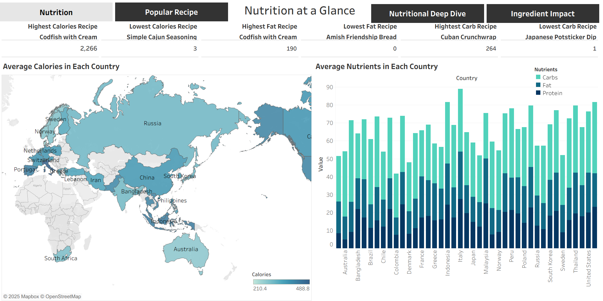
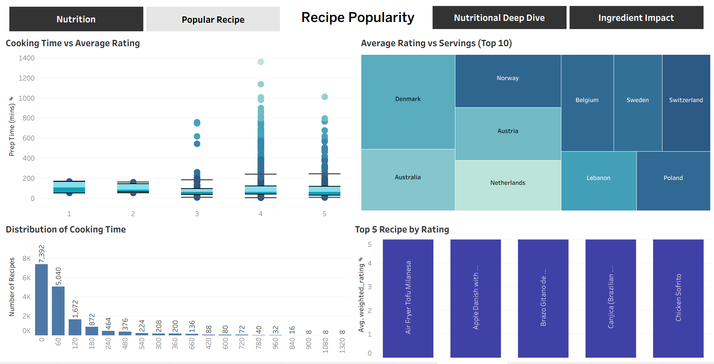
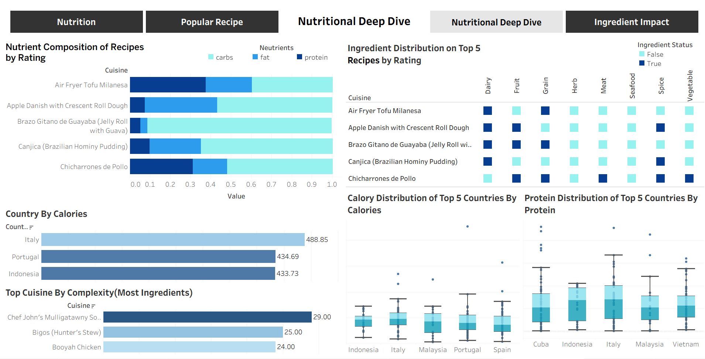
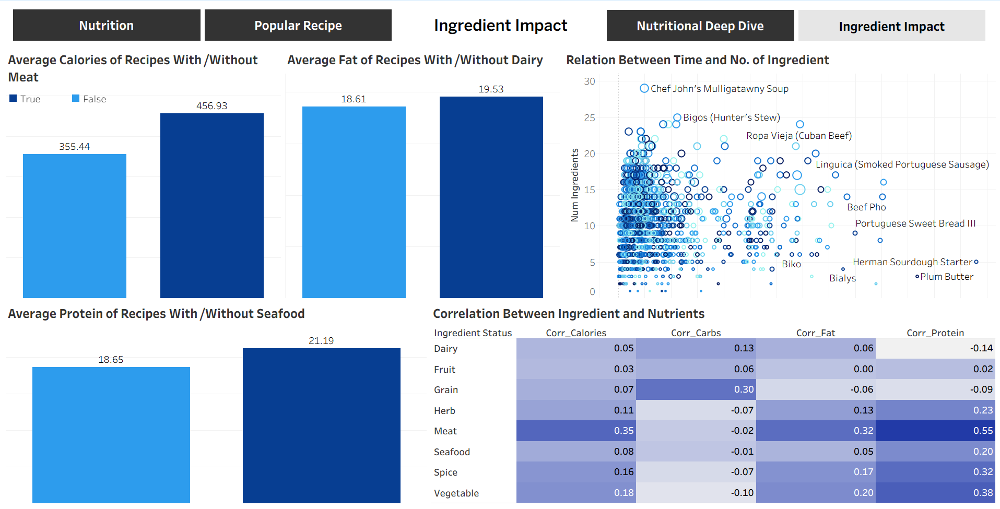

# Cuisine Analysis

This project collects, processes, and analyzes recipes from **AllRecipes.com** to uncover global cooking patterns, nutritional trends, and cultural differences in food preparation. It is designed for **food enthusiasts, nutrition researchers, data analysts, and anyone interested in exploring culinary diversity** through data-driven insights and interactive visualizations.

# Table of Contents

1. [Cuisine Analysis](#cuisine-analysis)

   * [Importnat Links](#important-links)
   * [Motivation](#motivation)
   * [Background](#background)
2. [Project Overview](#project-overview)

   * [1. Data Collection](#1-data-collection)
   * [2. Data Cleaning & Preprocessing](#2-data-cleaning--preprocessing)
   * [3. Feature Engineering](#3-feature-engineering)
   * [4. Data Export](#4-data-export)
   * [5. Tableau Dashboards](#5-tableau-dashboards)
3. [Tableau Dashboards](#tableau-dashboards)

   * [Dashboard 1: Cuisine Analysis](#dashboard-1-cuisine-analysis)
   * [Dashboard 2: Recipe Popularity](#dashboard-2-recipe-popularity)
   * [Dashboard 3: Nutritional Deep Dive](#dashboard-3-nutritional-deep-dive)
   * [Dashboard 4: Ingredient & Nutrition Impact](#dashboard-4-ingredient--nutrition-impact)

4. [Build from Source](#build-from-source)


### Important Links
<a href="https://public.tableau.com/views/CuisineAnalysis_17558876860730/Nutrition?:language=en-US&publish=yes&:sid=&:redirect=auth&:display_count=n&:origin=viz_share_link" target="_blank">🔗 Cuisine Analysis Tableau Dashboard</a>

<a href="https://www.allrecipes.com/cuisine-a-z-6740455" target="_blank">🔗 Source Site: AllRecipes.com </a>


### Motivation

Food is one of the most universal aspects of culture, yet recipes and nutrition data are often scattered across different sources. I wanted to bring this information together in a structured way and uncover meaningful insights. By scraping a **recipe website**, analyzing the data, and visualizing it in Tableau, this project aims to highlight cuisine trends, nutritional patterns, and ingredient usage in a way that is interactive, insightful, and easy to explore.

### Background

With the rise of global food delivery apps and recipe-sharing platforms, cuisine data has become both abundant and diverse. However, much of this information remains unstructured and difficult to analyze. This project was created to bridge that gap by scraping recipes, ingredients, and nutritional details from a recipe website, cleaning and analyzing the data, and then building an interactive Tableau dashboard. The goal is to better understand cuisine trends, compare nutritional values across dishes, and explore ingredient usage in a clear and visual way.

# Project Overview

This project collects, processes, and analyzes international cuisine recipes from **AllRecipes.com** to uncover insights about global cooking patterns, nutritional trends, and cultural differences in food preparation.

### 1. Data Collection

* Scraped recipe metadata (name, cuisine, link) for **2118 international recipes across cuisines**.
* Extracted detailed recipe information including:

  * Preparation time
  * Servings
  * Ingredients
  * Nutrition facts (calories, fat, carbs, protein)
  * Ratings and review counts

### 2. Data Cleaning & Preprocessing

* Handled missing values and inconsistent data formats.
* Standardized units (e.g., removed `g` from nutrition values).
* Parsed and converted time strings into **minutes**.
* Cleaned and lemmatized ingredient names using **NLP techniques**.
* Mapped cuisines to their respective **countries**.

### 3. Feature Engineering

* Identified **primary ingredients** using fuzzy matching.
* Flagged presence of food groups (meat, seafood, dairy, vegetables, etc.).
* Counted the **number of ingredients per recipe**.

### 4. Data Export

* After doing all of these steps finally there are 2118 data remaining.
* Saved the final cleaned and enriched dataset as:

  * `final_dataset.csv`
  * `final_dataset.xlsx`


# <a href="https://public.tableau.com/views/CuisineAnalysis_17558876860730/Nutrition?:language=en-US&publish=yes&:sid=&:redirect=auth&:display_count=n&:origin=viz_share_link" target="_blank" rel="noopener noreferrer">Tableau Dashboards</a>

## Dashboard 1: Cuisine Analysis



**Description**
This dashboard provides a global analysis of cuisine nutrition data, highlighting calorie, fat, carb, and protein distributions across countries and recipes.

**Visualizations & Features**

* KPI cards showing highest/lowest calorie, fat, and carb cuisines.
* World map displaying average calories by country.
* Bar chart comparing average nutrients (carbs, fat, protein) across countries.
* Tabs for exploring different perspectives (Nutrition, Popular Recipe, Nutritional Deep Dive, Ingredient Impact).

**Insights**

* "Codfish with Cream" is the highest-calorie and highest-fat **dish**, while "Simple Cajun Seasoning" and "Amish Friendship Bread" are on the low end.
* Countries vary significantly in calorie density, with certain regions (e.g., U.S., Europe) showing higher averages.
* Carbs make up the largest proportion of nutrients in most countries, followed by fat and protein.

## Dashboard 2: Recipe Popularity



**Description**
This dashboard explores recipe popularity by analyzing ratings, cooking time, and serving patterns across cuisines and countries.

**Visualizations & Features**

* Scatter plot of cooking time vs. average rating, sized by recipe popularity.
* Bar chart showing the distribution of cooking times across recipes.
* Treemap of top 10 countries by average rating and servings.
* Pie chart of the top 10 cuisines by rating.

**Insights**

* Most recipes are completed within 60 minutes, with fewer recipes requiring extended cooking times.
* Higher-rated recipes tend to cluster between 4–5 stars regardless of cooking time, suggesting rating is less dependent on prep duration.
* Denmark, Australia, and Norway appear among the top countries for high-rated and widely served recipes.
* Popular dishes include Tex-Mex Salsa, Filipino Pancit, Chimichurri, and others, showing diversity in global favorites.

## Dashboard 3: Nutritional Deep Dive



**Description**
This dashboard provides a detailed breakdown of nutrition and ingredients in top-rated cuisines, along with calorie and protein comparisons across countries.

**Visualizations & Features**

* Ingredient distribution matrix for top 10 recipes by rating (dairy, fruit, grain, herbs, meat, seafood, spices, vegetables).
* Horizontal bar charts for nutrient composition (carbs, fat, protein) of cuisines by rating.
* Country-level calorie comparison (Italy, Portugal, Indonesia leading).
* Cuisine complexity chart showing recipes with the highest ingredient count.
* Box plots of calorie distribution for top 5 countries by calories.
* Box plots of protein distribution for top 5 countries by protein.

**Insights**

* Italy records the highest calorie averages, followed by Portugal and Indonesia.
* Chef John’s Mulligatawny Soup stands out as the most ingredient-rich dish.
* Recipes show diverse nutrient compositions, with many leaning heavily on carbs.
* Protein distribution varies widely, with Italy and Vietnam showing higher ranges compared to others.

## Dashboard 4: Ingredient & Nutrition Impact



**Description**
This dashboard explores how the presence of specific ingredients (meat, dairy, seafood, grains, etc.) impacts the nutritional profile of cuisines. It also highlights the relationship between cooking complexity (time and ingredient count) and nutrient distribution.

**Visualizations & Features**

* Bar charts comparing average calories (with/without meat), average fat (with/without dairy), and average protein (with/without seafood).
* Scatter plot shows the relation between cooking time and number of ingredients, with labeled standout recipes (e.g., Chef John’s Mulligatawny Soup, Puerto Rican Sancocho).
* Correlation heatmap between ingredient categories (dairy, fruit, grain, herb, meat, seafood, spice, vegetable) and nutrient measures (calories, carbs, fat, protein).

**Insights**

* Meat significantly increases calorie content in cuisines (456 vs. 355 average calories).
* Seafood-rich recipes tend to have higher protein levels (21.19 vs. 18.65 average protein).
* Dairy has only a minor effect on fat content (19.53 vs. 18.61 average fat).
* Chef John’s Mulligatawny Soup and Puerto Rican Sancocho stand out as highly complex, ingredient-heavy dishes.
* Correlation analysis shows:

  * Meat has the strongest positive correlation with protein (0.55) and calories (0.35).
  * Vegetables and herbs contribute moderately to protein content.
  * Grains correlate most strongly with carbs (0.30).
  * Spices show minimal direct nutrient impact.

##  Build from Source

**Step 1: Install Dependencies**

Make sure you have Python 3.8 or later installed.
From the project root directory, install all required dependencies by running:

```bash
pip install -r requirements.txt
```

This will install all libraries needed for web scraping, preprocessing, and further analysis.


**Step 2: Run the Web Scraper**

Navigate to the **`src`** folder and execute the scraper script to collect data from the target website:

```bash
cd src
python scraper.py
```

This script performs automated scraping and saves the collected raw data in the predefined output path inside the project.

**Step 3: Data Preprocessing**

Once scraping is complete, open the preprocessing notebook to review and execute the data cleaning steps:

```bash
jupyter notebook preprocessing.ipynb
```

The notebook illustrates the complete preprocessing workflow, including data cleaning, transformation, and preparation for further modelling or analysis.


**Summary**

| File                      | Purpose                                 |
| ------------------------- | --------------------------------------- |
| `requirements.txt`        | Installs all project dependencies       |
| `src/scraper.py`          | Scrapes data from the website           |
| `src/preprocessing.ipynb` | Demonstrates the preprocessing pipeline |

---

**Python Version:** 3.8+
**Dependencies:** Listed in `requirements.txt`

---